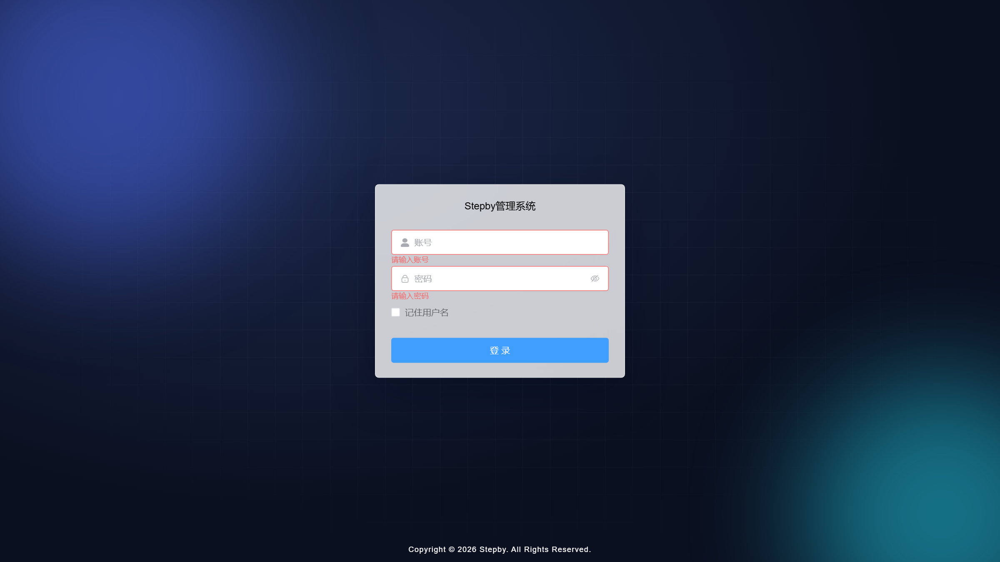
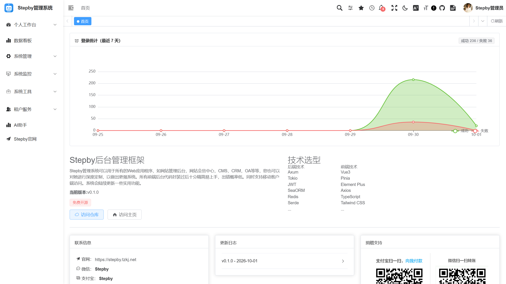
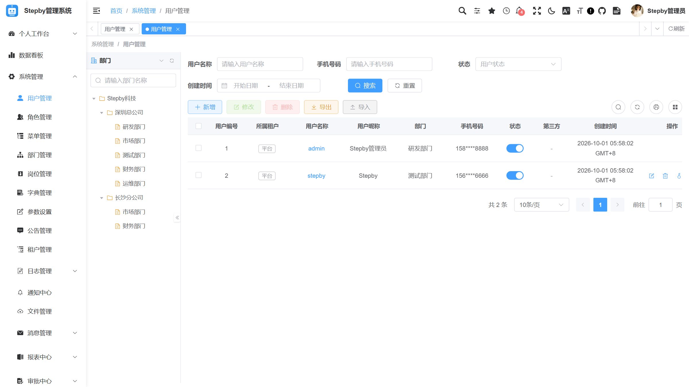
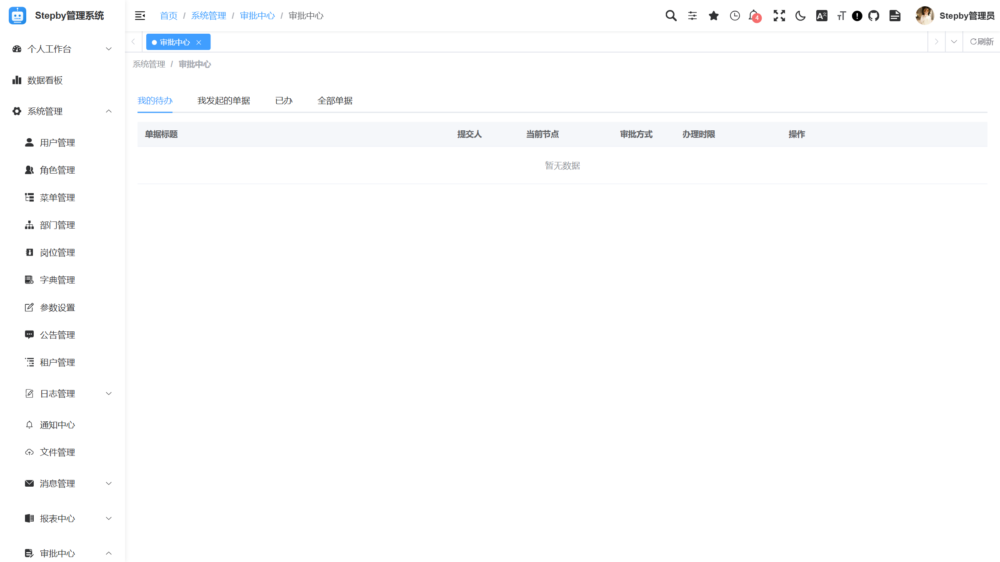
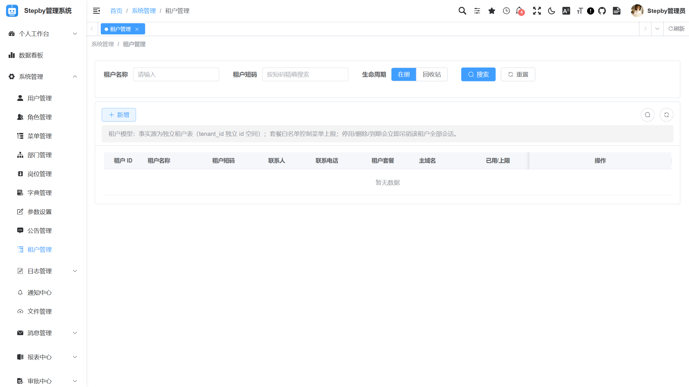
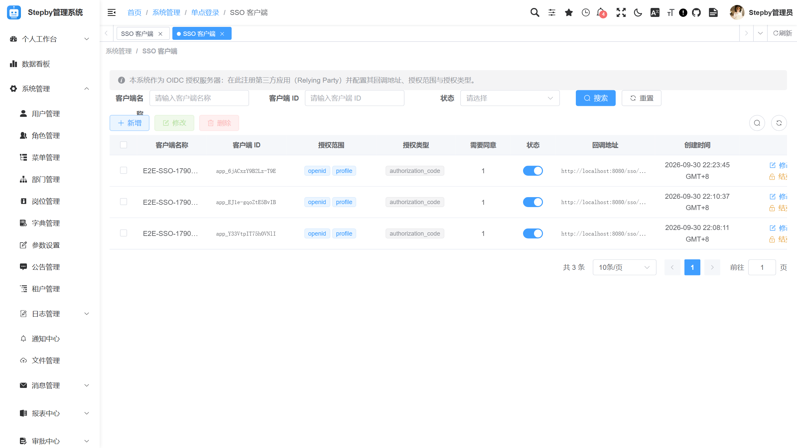
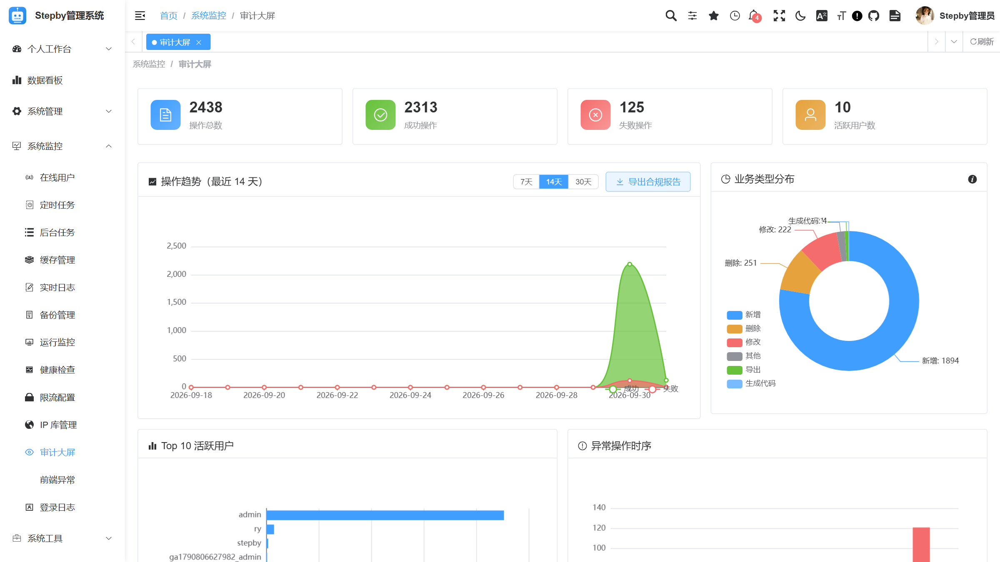

# Stepby Vue


Stepby 开源中后台管理系统前端，基于 **Vue 3 + TypeScript + Vite + Element Plus + TailwindCSS 4 + Pinia + Vue I18n** 构建。配套后端：[stepby-axum](https://github.com/stepbylabs/stepby-axum)（Rust / axum）。

## ✨ 功能特性

- **登录认证**：账号密码 + 验证码、TOTP 双因子、Passkey、首次登录强制改密
- **用户 / 角色 / 菜单**：RBAC 权限管理、动态菜单路由、数据权限
- **多租户**：租户管理、套餐能力位
- **SSO 登录**：OIDC 授权码登录、SSO 客户端管理
- **工作流审批**：两级审批流程可视化操作
- **审计大屏**：操作日志差异、审计数据可视化
- **国际化**：中文 / 英文（Vue I18n，菜单文案由后端 i18n key 驱动）
- **移动端响应式**：适配移动设备的响应式布局
- **多主题**：亮 / 暗模式、侧边栏三档主题、主题编辑器
- **代码生成器配套**：与后端代码生成器配套的前端页面模板

## 技术栈

- [Vue 3](https://v3.cn.vuejs.org) - 渐进式前端框架
- [Element Plus](https://element-plus.org/zh-CN) - UI 组件库
- [TypeScript](https://www.typescriptlang.org) - 类型安全
- [Pinia](https://pinia.vuejs.org/zh) - 状态管理
- [Vue Router 4](https://router.vuejs.org/zh) - 路由管理
- [Axios](https://axios-http.com/zh) - HTTP 请求库
- [Vite](https://cn.vitejs.dev) - 构建工具
- [Tailwind CSS 4](https://tailwindcss.com) - 原子化 CSS 框架
- [Vue I18n](https://vue-i18n.intlify.dev/) - 国际化

## 📸 预览

**登录页**



**用户管理**



**租户管理**



**审计大屏**



## 🚀 快速开始

```bash
# 环境要求：Node 20+（npm / pnpm 均可）
npm install

# 启动开发服务（默认端口 5173）
npm run dev

# 构建生产包
npm run build:prod

# 预览生产构建
npm run preview

# 类型检查
npm run typecheck
```

开发模式下前端通过 Vite 代理将 API 请求转发至后端 `http://localhost:8080`（见 `vite.config.ts`）。

默认账号：`admin` / `admin123`（首次登录强制修改密码）。

## 🧪 测试

```bash
npm run typecheck    # vue-tsc 类型检查
```

E2E 测试基于 Playwright，共 75 个功能、分三段执行，入口为 `tests/e2e/main.mjs`。运行前需：

1. 后端启动在 `http://localhost:8080`（零配置单文件即可）
2. 前端启动在 `http://localhost:5173`（或通过 `FRONTEND_URL` 环境变量指定）
3. 关闭验证码：参数 `sys.account.captchaEnabled = false`

## 📄 License

[MIT](LICENSE) © 2026 Stepby
